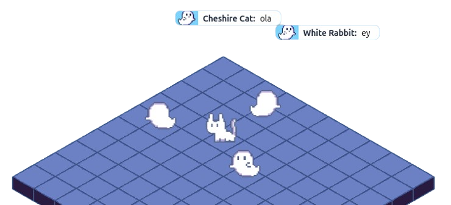

# ghoulies

### Overview

Web app that enables users to host and join chatrooms in a game-like environment allowing them to interact with others through text chat.

View Live [localhost](http://localhost/)  
REST API Docs [:8000/docs/index.html](http://localhost:8000/docs/index.html)  
WebSocket API Docs [:8000/wsdocs/index.html](http://localhost:8000/docs/index.html)

### Tech stack

- **Typescript** Javascript but better.
- **Golang** For high performance and efficient handling of concurrent connections.
- **Postgres** SQL database.
- **Redis** Memory-based data storage (gamer speed pro max) used mainly for keeping track of active Websocket sessions, rooms info and caching.
- **React** SPA for dynamic and interactive UI components.
- **HTML Canvas API** faster for complex, interactive graphics because it doesn't have to maintain a DOM for each object

### Setup

Make sure you have installed the latest version of docker desktop on your machine and on your path.

###### Development

Create `.env` files accordingly for each `.env-template`

```sh
make watch
```

```sh
make watch EXTERNAL_DB=true # when using a service like neon for postgres
```

Go visit [localhost](http://localhost/)

###### Release

```sh
make run ENV=release
```

### Docs

###### Using Swagger for REST API Docs

```sh
go install github.com/swaggo/swag/cmd/swag@latest
```

```sh
/bin/bash -c "$(go env GOPATH)/bin/swag init -g ./core/app/cmd/api/main.go -o ./core/app/docs/"
```

###### Using AsyncAPI for WebSocket API Docs

```sh
[p]npm|yarn install -g @asyncapi/generator
```

```sh
ag ./core/app/wsdocs/asyncapi.yaml @asyncapi/html-template -o ./core/app/wsdocs
```
